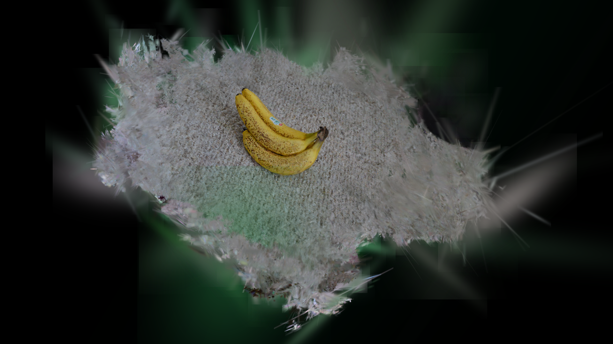
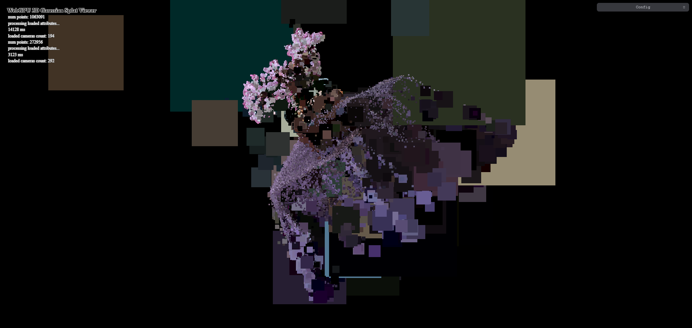
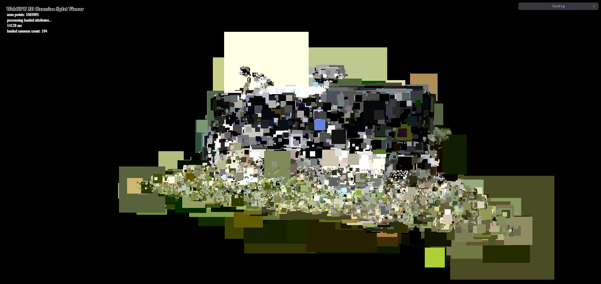
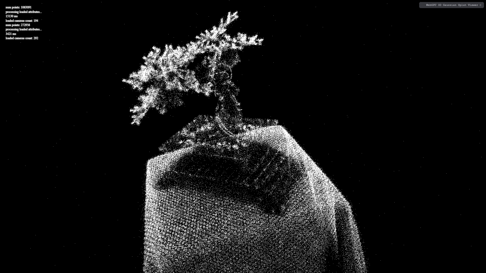
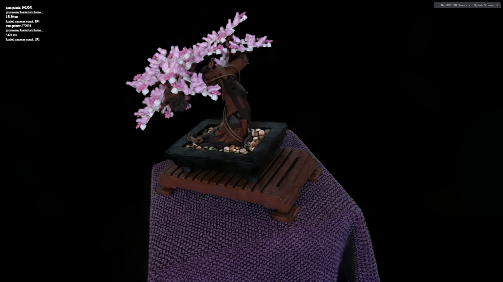

**University of Pennsylvania, CIS 5650: GPU Programming and Architecture, Project 5**

- Charles Wang
  - [LinkedIn](https://linkedin.com/in/zwcharl)
  - [Personal website](https://charleszw.com)
- Tested on:
  - Windows 11 Pro (26200.6899)
  - Ryzen 5 7600X @ 4.7Ghz
  - 32 GB RAM
  - RTX 5060 Ti 16 GB (Studio Driver 581.29)
  - Chromium 140.0.7339.128

# WebGPU Gaussian Splat Viewer

|  |
| :----------------------------------------------------------------------------: |
|                            Bicycle scene, 1920×1080                            |

## Demo

A live version of this project is available at [aczw.github.io/webgpu-gaussian-splat-viewer](https://aczw.github.io/webgpu-gaussian-splat-viewer). Note that you'll have to provide your own scene and camera file. Below is a screen recording of the viewer in action.

https://github.com/user-attachments/assets/a519f247-0154-4d76-97e9-85a9719e21f0

## Overview

This project aims to implement the [3D Gaussian Splatting for Real-Time Radiance Field Rendering](https://github.com/graphdeco-inria/gaussian-splatting) paper in WebGPU. It specifically focuses on the rasterization pipeline of the splats, meaning I did not concern myself with the training portion or creation of these gaussians.

I heavily referenced the original paper's rasterization engine, available at [graphdeco-inria/diff-gaussian-rasterization](https://github.com/graphdeco-inria/diff-gaussian-rasterization), for this project. It is written in C++ and CUDA; notably, it does not use a graphics API, meaning my implementation could not be a 1:1 translation.

The end result is an online viewer to load (theoretically) any gaussian splatting scene given the PLY file and at least one camera. For instance, let's grab the banana PLY file linked in the [OpenSplat](https://github.com/pierotofy/opensplat) README and try viewing it:

|  |
| :--------------------: |
|   Banana, 1920×1080    |

## Implementation

To draw a single frame, we perform three main steps.

1. Preprocess compute shader pass
2. Radix sort compute shader pass
3. Splat data render pass

### Preprocess compute pass

The preprocessing performs three major tasks. First, it ingests the raw gaussian data and computes necessary information used during rasterization. Second, we store some additional data in buffers to be used in the sorting pass. Third, we perform view frustum culling to reduce the number of computations and splats we'll need to draw in the end.

To rasterize each splat, we project the gaussian data in world space into 2D splat data. Information we need includes the splat center, radius from the center, conic, opacity, and color of the splat. We will use this information to shade each fragment of this splat.

For additional performance, we should cull splats that lie outside of the view frustum. This means that the number of points that enter the preprocess step may not equal the number of splats that we end up sorting and drawing.

Of note is that I use a slightly bigger bounding box for culling than the view frustum. For example, given normalized device coordinates, I check whether the splat center is between -1.2 and 1.2. This allows splats on the edge of the screen to still show up on screen.

### Sorting the splats

Alpha blending depends on the order we draw the splats, so have to sort them in order of view space depth. To do this, we associate each splat with a key that combines its index and its position's Z value in view space. We wrote these values into separate buffers that were populated during preprocessing.

### Rasterization

The render pass performs an indirect draw call that uses instanced rendering to draw quads for each splat within the view frustum. Between the preprocess step and render step, we update the instance count used for the draw call based on how many splats were culled.

Since the splats were sorted, we can use the instance index, provided via `@builtin(instance_index)` in the vertex shader, and use that to index into our global splat data buffer. Because of this, we guarantee that the splats are rendered back to front, enabling correct handling of transparency.

|  |  |
| :---------------------------------------: | :----------------------------------------: |
|        Bonsai, no opacity falloff         |        Bicycle, no opacity falloff         |

In the pictures above, we've correctly drawn the splat quads and colored them, but we haven't considered the exponential opacity falloff the further we get from the splat center.

Gaussians inherently model a distribution, so you may be wondering how we determine the radius for each splat. In my implementation, I consider the "cutoff" to be three standard deviations from the mean, which is the gaussian world position, aka the splat center. By the [68-95-99.7 rule](https://en.wikipedia.org/wiki/68%E2%80%9395%E2%80%9399.7_rule), we can think of this as covering 99.7% of the gaussian area.

## Performance analysis

To benchmark my implementation, I followed this article on [WebGPU Timing Performance](https://webgpufundamentals.org/webgpu/lessons/webgpu-timing.html#a-timestamp-query) from webgpufundamentals. WebGPU has an optional `timestamp-query` feature that allows us to check how long a GPU operation takes.

For my point cloud renderer, I timestamp the render pass. For my gaussian renderer, I timestamp both my render pass and my preprocess compute pass. I display both metrics in the Tweakpane when available.

> Note that `timestamp-query` is implementation-defined, meaning a different combination of browsers and GPU vendors may result in different metrics. For my tests I obviously stuck to the same devices, so the following results are still meaningful.

I use the timestamp query to measure my performance because Chromium caps the frame rate of the scene to your monitor's refresh rate. In my case, my scenes were consistently being capped, so I could not use this to accurately measure things.

If not specified, assume all the scenes are rendered at 1920×1080.

### Questions

> Compare your results from point-cloud and gaussian renderer, what are the differences?

The first obvious difference is how the gaussian splatting scene is rendered.

|  |  |
| :--------------------------: | :-----------------------------: |
|    Point cloud, 1920×1080    |       Gaussian, 1920×1080       |

Using the point cloud method, each splat is assigned a singular point of the same width. While in theory I could assign each point its associated color from the scene, this renderer was mostly for testing purposes and I moved on quickly. The gaussian renderer actually uses the gaussian data and performs the critical work of projecting the 3D data into 2D screen space, meaning each splat takes up a meaningful (and different) amount of screen space.

Implementation-wise, both renderers also very different. The point cloud renderer utilizes the GPU's native ability to draw point primitives. On the other hand, the gaussian renderer draws a quad made up of two triangles to render each splat, and uses the `triangle-list` primitive instead. It also has to perform additional work in the fragment shader to compute the color falloff from the splat center, while the point cloud can simply assign a static color. It also does not have to worry about alpha blending or transparency.

All of these differences make a meaningful impact on the render time. Here's a table comparing the render times for the bonsai scene as seen above.

| Configuration             | Render time (ms) |
| :------------------------ | :--------------- |
| Gaussian, 1.0× splat size | 0.483            |
| Gaussian, 1.5× splat size | 1.69             |
| Point cloud               | 0.130            |

> For gaussian renderer, how does changing the workgroup-size affect performance? Why do you think this is?

> Does view-frustum culling give performance improvement? Why do you think this is?

> Does number of guassians affect performance? Why do you think this is?

## Bloopers

You do one thing wrong, and everything breaks. Here are two examples of this happening.

|  |  |
| :--------------------------------------: | :-------------------------------: |
|   Associated wrong sort key with splat   |  Did not flip depth for sorting   |

## Credits

- [Vite](https://vitejs.dev/)
- [tweakpane](https://tweakpane.github.io/docs//v3/monitor-bindings/)
- [stats.js](https://github.com/mrdoob/stats.js)
- [wgpu-matrix](https://github.com/greggman/wgpu-matrix)
- Special thanks to Shrek Shao (from the Google WebGPU team) and the original [differential gaussian rasterizer](https://github.com/graphdeco-inria/diff-gaussian-rasterization) implementation
- [CIS 5650](https://cis5650-fall-2025.github.io) for providing the base code, including PLY scene loading, much of the point cloud renderer, and the radix sort compute pass.
