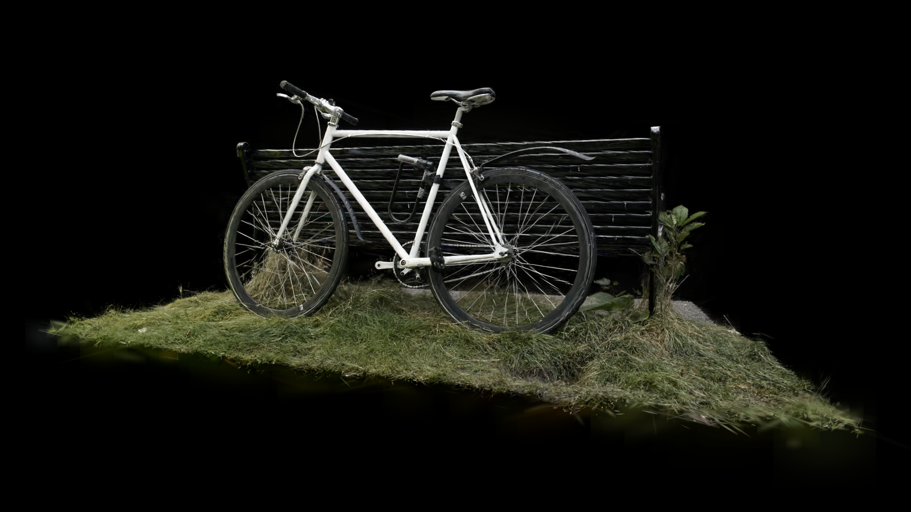

**University of Pennsylvania, CIS 5650: GPU Programming and Architecture, Project 5**

- Charles Wang
  - [LinkedIn](https://linkedin.com/in/zwcharl)
  - [Personal website](https://charleszw.com)
- Tested on:
  - Windows 11 Pro (26200.6899)
  - Ryzen 5 7600X @ 4.7Ghz
  - 32 GB RAM
  - RTX 5060 Ti 16 GB (Studio Driver 581.29)

# WebGPU Gaussian Splat Viewer

|  |
| :----------------------------------------------------------------------------: |
|                      Bicycle scene, rendered at 1920×1080                      |

## Demo

A live version of this project is available at [aczw.github.io/webgpu-gaussian-splat-viewer](https://aczw.github.io/webgpu-gaussian-splat-viewer). Note that you'll have to provide your own scene and camera file. Below is a screen recording of the viewer in action.

https://github.com/user-attachments/assets/a519f247-0154-4d76-97e9-85a9719e21f0

### Credits

- [Vite](https://vitejs.dev/)
- [tweakpane](https://tweakpane.github.io/docs//v3/monitor-bindings/)
- [stats.js](https://github.com/mrdoob/stats.js)
- [wgpu-matrix](https://github.com/greggman/wgpu-matrix)
- Special Thanks to: Shrek Shao (Google WebGPU team) & [Differential Guassian Renderer](https://github.com/graphdeco-inria/diff-gaussian-rasterization)
